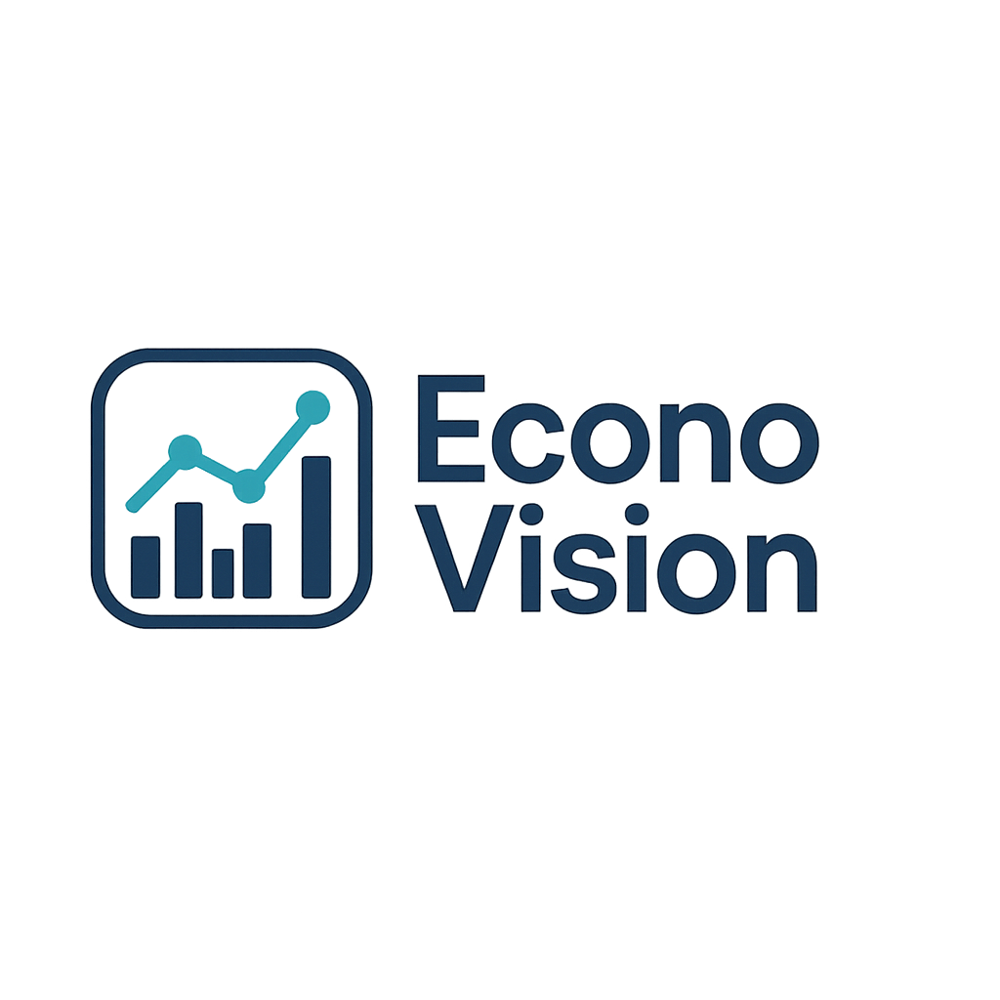

# FECAP - Fundação de Comércio Álvares Penteado

# Projeto Nubank  

## Grupo 1 - EconoVision

## Integrantes: <a href="https://www.linkedin.com/in/sabrinna-vicente-049225306/">Sabrinna Cristina Gomes Vicente</a>, <a href="https://www.linkedin.com/in/biaib/">Beatriz de Souza Santos Rio Branco</a>, <a href="https://www.linkedin.com/in/rodrigocgama04/">Rodrigo Correa da Gama</a>, <a href="https://www.linkedin.com/in/s%C3%A1tiro-gabriel-27081430b/">Sátiro Gabriel de Souza Santos</a>
## Professores Orientadores: <a href="https://www.linkedin.com/in/professorrodnil/">Rodnil da Silva</a>, <a href="https://www.linkedin.com/in/lucymari/">Lucy Mary Tabuti</a>, <a href="https://www.linkedin.com/in/paula-astorino-432b5812a/">Paula Astorino</a>, <a href="https://www.linkedin.com/in/eduardo-savino-gomes-77833a10/">Eduardo Savino Gomes</a>

## Descrição

EconoVision é uma iniciativa acadêmica desenvolvida com o objetivo de demonstrar o potencial da predição de dados macroeconômicos disponibilizados pelo Banco Central do Brasil. Por meio de uma plataforma interativa, o projeto foca em apoiar estrategicamente empresas do setor financeiro — como a Nubank — na análise e antecipação de cenários econômicos.

A solução integra dados oficiais, como SELIC, IPCA, taxa de câmbio e inadimplência, coletados automaticamente via API do Banco Central. Utilizando técnicas de ciência de dados, o sistema realiza análises descritivas e preditivas, oferecendo uma base sólida para decisões mais informadas e planejamentos estratégicos.

Desenvolvida com Plotly Dash, a plataforma permite visualizar tendências macroeconômicas em tempo real, realizar simulações e interpretar comportamentos do mercado de maneira intuitiva e acessível. Mesmo usuários sem conhecimento técnico podem extrair insights valiosos para suas estratégias financeiras.

Além de ser uma ferramenta de apoio à tomada de decisão, o projeto é modular, documentado e preparado para expansões futuras, como análise setorial específica, notificações personalizadas e integração com sistemas internos corporativos.

## 🛠 Estrutura de pastas

-Raiz 
| 
|-->documentos 
  &emsp;|-->Entrega 1 
    &emsp;|-->Analise Inferencial 
    &emsp;|-->Ciencia de Dados 
    &emsp;|-->Contabilidade 
    &emsp;|-->Documentação 
    &emsp;|-->ES & AS 
  &emsp;|-->Entrega 2 
    &emsp;|-->Analise Inferencial  
    &emsp;|-->Ciencia de Dados 
    &emsp;|-->Contabilidade  
    &emsp;|-->ES & AS 
 &emsp;|-->Entrega 3 
|-->imagens 
|-->src 
  &emsp;|-->_pycache_ 
  &emsp;|-->modules 
     &emsp;|-->_pycache_ 
  &emsp;|-->pages 
|-->imagens 
|Projeto1.sln 
|readme.md 

## 🛠 Instalação

Não há instalação!

## 💻 Configuração para Desenvolvimento

Para abrir este projeto você necessita das seguintes ferramentas:

-<a href="https://www.r-project.org/">R</a>

-<a href="https://posit.co/download/rstudio-desktop/">RStudio</a>

## 📋 Licença/License
Este projeto está licenciado sob a licença CC BY 4.0.
Você pode criar a sua própria licença Creative Commons em: https://chooser-beta.creativecommons.org/

## 🎓 Referências

Aqui estão as referências usadas no projeto.

1. <https://github.com/iuricode/readme-template>
2. <https://github.com/gabrieldejesus/readme-model>
3. <https://creativecommons.org/share-your-work/>
4. <https://www.bcb.gov.br/>

## Links 
<a href="https://www.figma.com/design/uMM3LvFLiuEK1jBQe9t8o7/Painel-NEON?node-id=6-228&t=xY0Vfuu9iFxM4w2r-1">Figma</a>

